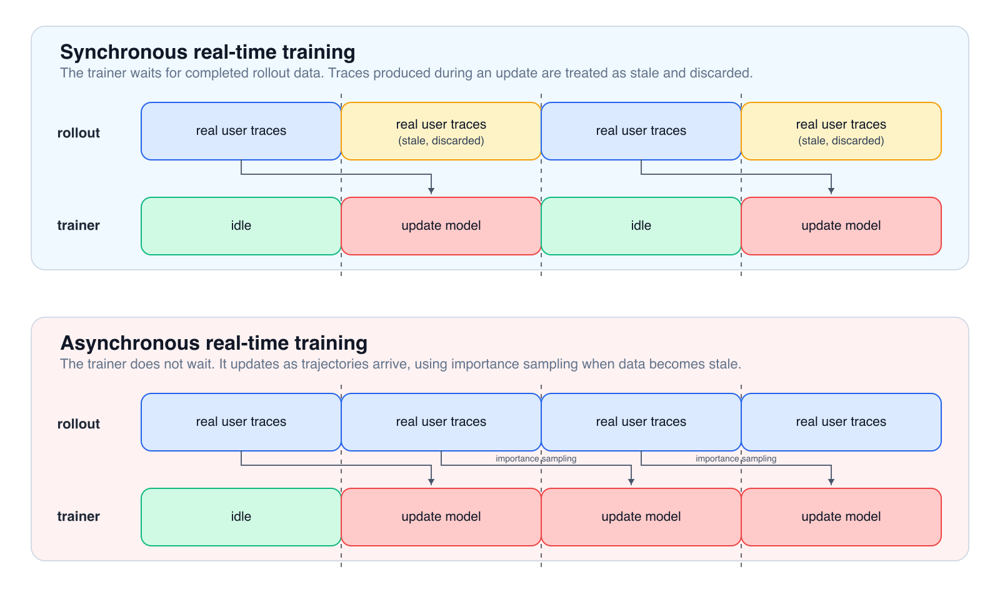
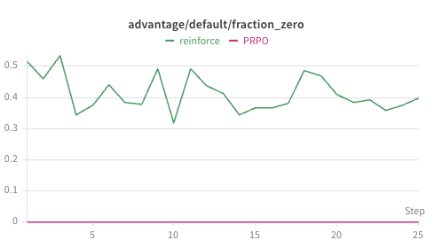
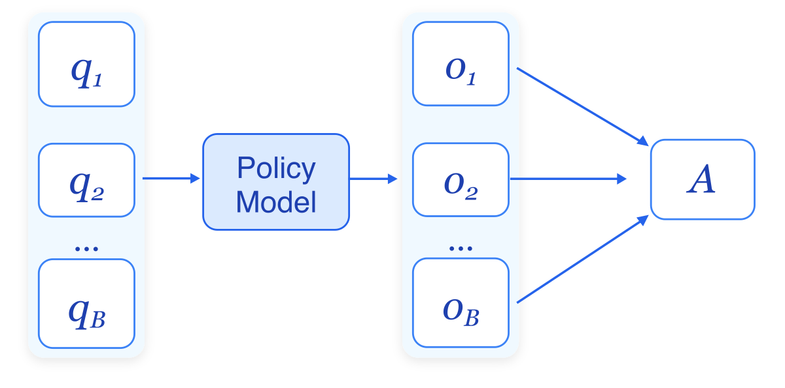

Imagine training an AI agent that learns from every **real** user interaction—not in a sandbox with carefully curated data, but from messy, asynchronous production traffic where each task happens exactly once. This is the challenge of continual learning for agents, and it is fundamentally different from how we typically train models via RL today.

In this post, we study how to solve several fundamental challenges in real-time RL for agents. We trained a Qwen3-Coder-30B on [MigrationBench](https://amazon-science.github.io/MigrationBench/), a repository-level Java 8 to Java 17 migration benchmark, using a mocked real-time single-rollout RL setup with [rLLM](https://github.com/rllm-org/rllm). We are able to improve migration success rate from **44%** to **59.2%**, a **15.2% absolute gain** from real-time RL. For context, Claude 4.5 Haiku reaches **71%**, and our GRPO experiment with group size 8 reaches **73%** on the same benchmark setting.

## The Challenge: From Sandbox to Production

Most RL training happens in controlled environments. Take [GRPO](https://arxiv.org/abs/2402.03300) (Group Relative Policy Optimization) for example: you sample multiple rollouts per task, compute group-relative advantages, and rely on episode-level verifier scores. It works beautifully when you have the luxury of replaying tasks and generating multiple attempts.

But production systems don't work that way. When a user asks your agent to perform a coding task or answer a question, you get exactly one rollout. By the time that trajectory makes it to your training queue, your model has already updated on hundreds of other real-time tasks. The policy that generated the data is no longer the policy you're trying to improve.

  

Figure 1 highlights the difference between synchronous rollout training and asynchronous real-time RL. In the synchronous setting, the trainer waits for rollout data and updates only after sufficient number of trajectories are ready. This keeps training fully on-policy, but it is inefficient: the trainer can sit idle while waiting for slow rollouts, and newly generated traces need to be discarded. In the asynchronous setting, rollouts and training proceed concurrently, improving throughput but introducing policy staleness. Separately, because real production tasks are usually attempted only once, we lose the repeated-rollout signal that methods like GRPO rely on. Together, these constraints create three practical challenges:

1. **High variance reward** from single-rollout-per-task, since we cannot average over multiple attempts for the same query
2. **Policy staleness** from asynchronous updates, since trajectories may be used for training after the policy has already been updated
3. **Insufficient learning signal** from zero rewards, since a single failed rollout can contribute no gradient

## Our Solution: Population-Relative Advantages

We introduce **Population-Relative Policy Optimization (PRPO)**. The basic idea is to use a baseline to turn raw rewards into relative advantages, rather than using each rollout reward in isolation. In standard multi-rollout methods, the baseline is usually computed from multiple attempts at the same query. In our setting, we do not have those repeated attempts, so PRPO uses a population-level baseline: it compares rewards across different tasks in the batch. In REINFORCE with raw rewards, the policy-gradient update is weighted directly by the rollout reward, so a reward of $0$ produces no update at all. Unlike REINFORCE, a rollout that scores $0$ isn't useless anymore—if the batch average is $0.3$, that $0$ becomes a negative advantage signal, telling the model "this approach performed worse than average."

For stale data, we adopt the traditional wisdom from PPO: use importance sampling to account for the mismatch between the policy that generated a rollout and the policy being updated.

We keep this section high-level; the detailed derivation and implementation of PRPO are in [How PRPO Works](#how-prpo-works).

## Results: Real-Time RL in Action

We study this setting by mocking real-time RL in rLLM. Each prompt is rolled out once, each trajectory is consumed for training once, and the trainer operates on the stream of completed agent tasks rather than repeatedly sampling multiple attempts for the same query. This setup lets us study the core single-rollout learning problem while keeping the infrastructure close to existing RL training stacks.

We train a Java migration agent on [MigrationBench](https://arxiv.org/abs/2505.09569). MigrationBench evaluates repository-level Java migration. It contains 5,102 repositories and provides a curated 300-repository evaluation subset. A task is counted as solved only if the edited project builds under Java 17, its tests pass, and the number of tests is non-decreasing. This last condition matters: the agent must preserve the test suite rather than making the project pass by deleting failing tests.

We use the minimal-migration setting, where the agent has access to shell and editor tools but does not need to upgrade any Java library to the newest available version. The maximal-migration setting adds that stronger library-upgrade requirement, and we leave it as a natural next target. Our agent is implemented with [Strands](https://strandsagents.com/).

With **PRPO** in this mocked real-time RL setup, the best setting improves Qwen3-Coder-30B from **44%** to **59.2%** success rate on MigrationBench, a **15.2% absolute gain** over the baseline model. For context, Claude 4.5 Haiku reaches **71%**; in our multi-rollout GRPO experiment with group size 8 on the same benchmark setting, we achieve **73%**. Although this still leaves a gap to stronger models and multi-rollout training, it shows that real-time single-rollout RL can produce substantial gains.

## Key Takeaways

Our [experiments](#experimental-results) suggest that real-time RL is a feasible and promising direction for training agents from production-style interactions. PRPO works well under the single-rollout constraint by making each trajectory more informative.

1. **PRPO improves data efficiency over REINFORCE with raw rewards.** Some tasks are hard, and the reward is not fine-grained enough to distinguish partial progress, so many rollouts receive zero reward at the end. Raw-reward REINFORCE gets no gradient signal from those trajectories, while PRPO turns them into useful relative comparisons. As shown in Figure 2, without baseline centering, roughly 30-50% of rollouts have zero advantage; with PRPO, nearly every rollout contributes a learning signal.

  

2. **Synchronous rollout training gives stronger gains than training on stale data.** When training uses fresher trajectories, the learning signal is cleaner and the improvement is larger. In our experiments, the synchronous setting reaches **59.2%** success rate, while the best asynchronous setting reaches **51.8%**.

3. **Rollout-training mismatch is significant in asynchronous real-time RL.** Real-time systems often generate rollouts with one engine and compute losses with another. This mismatch can destabilize training: in the asynchronous setting, training collapses to **4%** when we correct policy staleness but not rollout-training mismatch, while correcting both recovers stable training. Therefore, rollout correction is sometimes needed as a practical solution.

---

## How PRPO Works

This section covers the mathematical foundations and implementation details behind PRPO.

### The REINFORCE Algorithm

The REINFORCE algorithm forms the foundation of policy gradient methods in reinforcement learning. At its core, REINFORCE optimizes a policy $\pi_\theta$ by maximizing the expected return over a dataset $D$:

$$\max_\theta J_{\text{REINFORCE}}(\theta) = \max_\theta E_{y\sim\pi_{\theta}}[R(y)]$$

The expected return $J_{\text{REINFORCE}}(\theta)$ is maximized by policy gradient method and its gradient is given by:

$$\nabla_\theta J_{\text{REINFORCE}}(\theta) = E_{y\sim\pi_{\theta}}[R(y)\nabla_\theta\log\pi_\theta(y)]\tag{1}$$

The key insight of REINFORCE is that by sampling trajectories from the current policy and weighting the log-probability gradients by the trajectory return, we reinforce trajectories in proportion to their reward. However, vanilla REINFORCE suffers from several challenges that make it impractical for continual learning scenarios:

#### High variance
The return $R(y)$ can vary significantly across trajectories, leading to unstable gradient estimates, especially when only a single trajectory is available per prompt. A common way to reduce this variance is to subtract a baseline, so the model learns from relative performance rather than raw reward alone. GRPO adopts this idea by subtracting the within-group mean reward. In continual learning, where only one rollout is available per group, we instead use the cross-prompt mean within a training batch to standardize rewards.

#### On-policy requirement
REINFORCE assumes trajectories are sampled from the current policy $\pi_\theta$. In continual learning, this assumption is often violated: by the time a trajectory is used for training, the policy may have already been updated, making the data stale ([Figure 1](#figure-1)). This mismatch can introduce instability and inefficiency. Importance sampling (IS) from PPO is one way to correct for the discrepancy between the behavior policy and the current policy.

#### Insufficient learning signal
REINFORCE uses the raw reward as the advantage, so trajectories with zero reward produce zero gradient and contribute nothing to parameter updates. When rewards are frequently zero, this leads to poor sampling efficiency. PRPO addresses this by giving each rollout a population-relative learning signal.

### Population Relative Policy Optimization (PRPO)

#### Baselines and Advantages

The high variance of the vanilla REINFORCE gradient estimator stems from the fact that trajectory returns $R(y)$ can vary dramatically across different tasks, leading to noisy and unstable gradient updates. A fundamental technique for reducing this variance is to subtract a baseline $b$ from the return when computing policy gradients. The modified gradient estimator becomes:

$$E_{y\sim\pi_{\theta}}[(R(y)-b)\nabla_\theta\log\pi_\theta(y)]\tag{2}$$

The term $b$ is called a baseline and $R(y) - b$ is called the advantage. With some elementary probability theory, we can prove that the gradient $\nabla_\theta J(\theta)$ defined in Equation (1) is exactly equal to Equation (2). To see this, it suffices to prove that $E_{y\sim \pi_\theta}\big[b\nabla_\theta\log\pi_\theta(y)\big] = 0$. In fact,

$$
\begin{aligned}
E_{y\sim \pi_\theta}\big[b\nabla_\theta\log\pi_\theta(y)\big]
= b\cdot\int\nabla_\theta\pi_\theta(y)\mathrm{d}y \\
= b\cdot\nabla_\theta
    \underbrace{\int \pi_\theta(y)\mathrm{d}y}_{=1} \\
= 0
\end{aligned}
$$

The same argument also allows the baseline to depend on the task prompt $q$, as long as it does not depend on the sampled rollout $y$ after $q$ is fixed.

#### From GRPO to PRPO

In GRPO, the baseline is defined per task. Concretely, for a given query $q$, the baseline is the expected reward under the current policy: $b(q) = E_{y\sim\pi_\theta(q)}[R(y)]$. In practice, this expectation is approximated by sampling multiple rollouts $y_1,\dots, y_g$ for the same query $q$, and computing their in-group sample mean. The resulting advantage is therefore group-relative.

In contrast, we propose **Population-Relative Policy Optimization (PRPO)**, where the baseline is defined globally over the task population: $b(D) = E_{q\sim D, y\sim\pi_\theta(q)}[R(y)]$. Rather than conditioned on a single query, this baseline captures the overall expected reward across all tasks. We estimate it using the cross-task mean of rewards across all rollouts:

$$\nabla_\theta J(\theta) = E_{y\sim\pi_{\theta}}[(R(y)-b)\nabla_\theta\log\pi_\theta(y)] \approx \frac1{|\mathcal{B}|}\sum_{q\in\mathcal{B}}[R(y_i)-\text{avg}(R)]\nabla_\theta\log\pi_\theta(y_i|q)\tag{3},$$
where $\mathcal{B}$ is the training batch and $y_i\sim\pi_\theta(\cdot|q_i)$ for each $q_i\in\mathcal{B}$.

  

Figure 3 illustrates the PRPO pipeline: each prompt in the batch produces one rollout from the policy model, and the batch is used to compute the population-relative advantage $A$.

From the above equation, the term $A_i = R(y_i) - \text{avg}(R)$ is effectively the advantage estimates, where $\text{avg}(R)$ is computed across different prompts within a training batch. Note that this empirical average does depend on the sampled rollouts $y$ in the batch. This means it is not the exact rollout-independent baseline from the unbiasedness argument above. But in practice, this estimator works well, so we do not need to be overly strict about this distinction. PRPO centering reduces variance by removing common offsets in rewards and rescales the signal to reflect relative performance within the batch, while also mitigating the zero-reward issue by assigning non-zero advantages to trajectories that are above or below the batch average. As a result, PRPO is better suited for the continual learning setting where only one rollout is available per task. 

#### Scaling Normalization

Note that GRPO additionally divides the advantage by the standard deviation of $R(y_i)$. Although some recent work has started to remove this scaling normalization, GRPO still shows that it can be useful in practice. Therefore, we also divide the centered reward by the standard deviation in PRPO. An implementation of PRPO is available in rLLM in this PR [PR link coming soon].

#### Relation to REINFORCE++

Our PRPO implementation is similar to [REINFORCE++](https://arxiv.org/pdf/2501.03262), which also explores global normalization, but differs from it in the following ways:

- REINFORCE++ incorporates token-level KL loss into the advantage. PRPO does not include KL in the advantage, though it can still include KL as a separate term in the policy-gradient loss.
- When group size $>1$, REINFORCE++ still uses a within-group mean baseline. In contrast, PRPO uses the population mean regardless of the group size.

### Corrections for Stale Policy Data

Production data can become stale. A user submits a query, the model generates a response, and the resulting trajectory is eventually added to the training queue—but by that time, the trainer may have already updated on earlier completed rollouts. As a result, the policy being optimized no longer matches the one that generated the data.

#### Importance Sampling for Policy Staleness

To increase data efficiency in continual learning, we want to use all collected trajectories for training, even if they were generated by an older version of the policy. This means we need to handle off-policy data—rollouts sampled from a behavior policy $p$ (typically $\pi_{\theta-K}$, where $K$ is the allowed data staleness) that differs from the current policy $\pi_\theta$ being optimized.

**Adapting REINFORCE for off-policy data.** We start with the standard REINFORCE gradient from Equation (1), which assumes on-policy sampling from $\pi_\theta$:

$$\nabla_\theta J_{\text{REINFORCE}}(\theta) = E_{y\sim\pi_\theta}[A\nabla_\theta\log\pi_\theta(y)]$$

To use data from behavior policy $p$, we change the sampling distribution using importance sampling. This corrects for the distribution mismatch by reweighting samples with the ratio $\frac{\pi_\theta(y)}{p(y)}$:

\begin{align}
    \nabla_\theta J_{\text{REINFORCE}}(\theta) &= E_{y\sim\pi_\theta}[A\nabla_\theta\log\pi_\theta(y)]\notag\\\\
    &= \int \pi_\theta(y)A\nabla_\theta\log\pi_\theta(y)\mathrm{d}y\notag\\\\
    &= \int p(y)\frac{\pi_\theta(y)}{p(y)}A\nabla_\theta\log\pi_\theta(y)\mathrm{d}y\notag\\\\
    &= E_{y\sim p}\left[\frac{\pi_\theta(y)}{p(y)}A\nabla_\theta\log\pi_\theta(y)\right]\tag{4}
\end{align}

This is **off-policy REINFORCE**—the REINFORCE gradient adapted to use data from a different behavior policy.

**Connection to PPO.** The same importance-weighted gradient appears when differentiating the unclipped PPO surrogate. The PPO objective without clipping is:

$$J_{\text{PPO}}(\theta) = E_{y\sim p}\left[\frac{\pi_\theta(y)}{p(y)}A\right]$$

Taking its gradient with respect to $\theta$:

\begin{align}
    \nabla_\theta J_{\text{PPO}}(\theta) &= E_{y\sim p}\left[\frac{\nabla_\theta\pi_\theta(y)}{p(y)}A\right]\notag\\\\
    &= E_{y\sim p}\left[\frac{\pi_\theta(y)}{p(y)}\frac{\nabla_\theta\pi_\theta(y)}{\pi_\theta(y)}A\right]\notag\\\\
    &= E_{y\sim p}\left[\frac{\pi_\theta(y)}{p(y)}\nabla_\theta\log\pi_\theta(y)A\right]\tag{5}
\end{align}

Comparing Equations (4) and (5), we see that the off-policy REINFORCE gradient has the same form as the gradient of the unclipped PPO surrogate. This is why standard PPO implementations are a natural starting point for stale-policy correction.

#### PPO Clip

While the connection above is useful, there is a practical problem: the importance ratio $\frac{\pi_\theta(y)}{p(y)}$ can become very large. If the behavior policy $p$ generates rare tokens with positive advantage, and the current policy increases their probability after several updates, the ratio can explode and destabilize training.

This is why PPO uses **clipping**. The full PPO objective with clipping is:

$$J_{\text{PPO}}^{\text{CLIP}}(\theta) = E_{y\sim p}\left[\min\left(\frac{\pi_\theta(y)}{p(y)}A, \text{clip}\big(\frac{\pi_\theta(y)}{p(y)}, 1-\epsilon, 1+\epsilon\big)A\right)\right]$$

The $\min$ operator takes the smaller of the unclipped and clipped objectives, ensuring conservative policy updates.

#### Rollout-Training Mismatch

All the above mathematical derivation assumes that the same numerical policy is used for rollout and training. However, in practice, rollout engines often use inference-optimized systems such as vLLM or SGLang for generation, while loss computation is performed using training frameworks such as FSDP or Megatron. Even when the underlying model and parameters are identical, the log-probabilities computed by these different execution engines can differ slightly.

This is not the same as policy staleness. Policy staleness compares $\pi_{\theta-K}$ with $\pi_\theta$ across training steps. Rollout-training mismatch compares two implementations of nominally the same policy. A full treatment of this mismatch is beyond the scope of this post, but two possible corrections are:

**PPO-IS** directly uses the importance ratio between FSDP (training engine) and vLLM (rollout engine) within the PPO objective.

$$J_{\text{PPO-IS}}(\theta) = E\left[\min\left(\frac{\pi_\theta^{\textcolor{blue}{\text{FSDP}}}(y)}{\pi_{\theta_{\text{old}}}^{\textcolor{red}{\text{vLLM}}}(y)}~ A, \text{clip}\left(\frac{\pi_\theta^{\textcolor{blue}{\text{FSDP}}}(y)}{\pi_{\theta_{\text{old}}}^{\textcolor{red}{\text{vLLM}}}(y)}, 1-\epsilon, 1+\epsilon\right)~ A\right)\right]$$

**Vanilla-IS** applies regular PPO loss but multiplies by an additional weight $\min\\{\frac{\pi_{\theta_{\text{old}}}^{\textcolor{blue}{\text{FSDP}}}(y)}{\pi_{\theta_{\text{old}}}^{\textcolor{red}{\text{vLLM}}}(y)}, C\\}$:

$$J_{\text{vanilla-IS}}(\theta) = E\left[\min\left\\{\frac{\pi_{\theta_{\text{old}}}^{\textcolor{blue}{\text{FSDP}}}(y)}{\pi_{\theta_{\text{old}}}^{\textcolor{red}{\text{vLLM}}}(y)}, C\right\\}\cdot\min\left(\frac{\pi_\theta^{\textcolor{blue}{\text{FSDP}}}(y)}{\pi_{\theta_{\text{old}}}^{\textcolor{blue}{\text{FSDP}}}(y)}~ A, \text{clip}\left(\frac{\pi_\theta^{\textcolor{blue}{\text{FSDP}}}(y)}{\pi_{\theta_{\text{old}}}^{\textcolor{blue}{\text{FSDP}}}(y)}, 1-\epsilon, 1+\epsilon\right)~ A\right)\right]$$

For a detailed discussion of these methods, see the blog post: <a href="https://fengyao.notion.site/off-policy-rl" style="color:#003d99">Your Efficient RL Framework Secretly Brings You Off-Policy RL Training</a>.

## Experiments

We mock a real-time agentic RL scenario in the rLLM package by setting both the group size and the trainer epoch to 1. All experiments use PRPO to compute the advantages to train  [Qwen3-Coder-30B-A3B-Instruct](https://huggingface.co/Qwen/Qwen3-Coder-30B-A3B-Instruct) on [MigrationBench](https://amazon-science.github.io/MigrationBench/), with 3,000 training samples and a 300 test samples.

### Experimental Results

We evaluate both synchronous and asynchronous rollout training. The synchronous setting becomes fully on-policy if we ignore rollout-training mismatch, while the asynchronous setting introduces policy staleness. For synchronous training, we set both the train batch size and mini batch size to 128. For asynchronous training, we keep the train batch size at 128 but use a mini batch size of 32. We also optionally apply PPO-IS or vanilla-IS to correct rollout-training mismatch. The full results are summarized below:

<table>
  <thead>
    <tr>
      <th>Exp.</th>
      <th style="text-align: center; vertical-align: middle;">Setting</th>
      <th>Rollout Correction</th>
      <th>Advantage Algorithm</th>
      <th>Final Success Rate</th>
      <th>Peak Success Rate</th>
    </tr>
  </thead>
  <tbody>
    <tr>
      <td>0</td>
      <td style="text-align: center; vertical-align: middle;">Base Qwen-Coder-30B</td>
      <td>-</td>
      <td>-</td>
      <td>44%</td>
      <td>44%</td>
    </tr>
    <tr>
      <td>1</td>
      <td rowspan="3" style="text-align: center; vertical-align: middle;">Synchronous</td>
      <td>-</td>
      <td>REINFORCE</td>
      <td>48.2%</td>
      <td>48.2%</td>
    </tr>
    <tr>
      <td><strong>2</strong></td>
      <td><strong>-</strong></td>
      <td><strong>PRPO</strong></td>
      <td><strong>59.2%</strong></td>
      <td><strong>59.2%</strong></td>
    </tr>
    <tr>
      <td>3</td>
      <td>vanilla-IS</td>
      <td>PRPO</td>
      <td>47.5%</td>
      <td>47.8%</td>
    </tr>
    <tr>
      <td>4</td>
      <td rowspan="3" style="text-align: center; vertical-align: middle;">Async</td>
      <td>-</td>
      <td>PRPO</td>
      <td>4%</td>
      <td>-</td>
    </tr>
    <tr>
      <td>5</td>
      <td>PPO-IS</td>
      <td>PRPO</td>
      <td>48.8%</td>
      <td>50.8%</td>
    </tr>
    <tr>
      <td><strong>6</strong></td>
      <td><strong>vanilla-IS</strong></td>
      <td><strong>PRPO</strong></td>
      <td><strong>49.2%</strong></td>
      <td><strong>51.8%</strong></td>
    </tr>
  </tbody>
</table>

### Discussion

#### Finding 1: Baseline Centering Improves Data Efficiency Beyond Variance Reduction

MigrationBench rewards take only three values, $\{0, 0.5, 1\}$, so many failed rollouts receive exactly zero reward. [Figure 2](#figure-2) shows the practical effect: without centering, roughly 30%-50% of rollouts have zero advantage and contribute no gradient; with PRPO, nearly every rollout becomes informative. This helps explain why Exp. 2 substantially outperforms the REINFORCE baseline in Exp. 1.

#### Finding 2: Rollout Correction Can Stabilize Async Training

The table shows that rollout correction is not universally beneficial: in the synchronous setting, adding vanilla-IS corresponds to lower performance (Exp. 3 vs. Exp. 2). But in the asynchronous setting, rollout-training mismatch can be severe enough to destabilize learning. Without rollout correction, the async run collapses to **4%** (Exp. 4); with PPO-IS and vanilla-IS, it recovers a stable training (Exp. 5 & Exp. 6).

  

[Figure 4](#figure-4) compares Exp. 4 (green) and Exp. 6 (red). In Exp. 4, the async run without rollout correction, KL divergence grows rapidly, gradient norms become large, and the average reward eventually collapses. This suggests that the model receives overly aggressive updates as the rollout and training distributions drift apart.

With vanilla-IS in Exp. 6, training remains much more stable. The correction weights are mostly below $1$, which dampens large updates and keeps the policy closer to the reference model.

<strong>Practical lesson:</strong> rollout correction is not something to enable blindly, but when training becomes unstable, correcting rollout-training mismatch can be the difference between collapse and usable learning.

## References

[1] Liu, Linbo, Xinle Liu, Qiang Zhou, Lin Chen, Yihan Liu, Hoan Nguyen, Behrooz Omidvar-Tehrani et al. "[MigrationBench: Repository-Level Code Migration Benchmark from Java 8](https://arxiv.org/abs/2505.09569)." arXiv preprint arXiv:2505.09569 (2025).

[2] Shao, Zhihong, Peiyi Wang, Qihao Zhu, Runxin Xu, Junxiao Song, Xiao Bi, Haowei Zhang et al. "[DeepSeekMath: Pushing the Limits of Mathematical Reasoning in Open Language Models](https://arxiv.org/abs/2402.03300)." arXiv preprint arXiv:2402.03300 (2024).

[3] Williams, Ronald J. "[Simple Statistical Gradient-Following Algorithms for Connectionist Reinforcement Learning](https://link.springer.com/article/10.1007/BF00992696)." Machine Learning 8, no. 3 (1992): 229-256.

[4] Hu, Jian, Jason Klein Liu, Haotian Xu, and Wei Shen. "[REINFORCE++: Stabilizing Critic-Free Policy Optimization with Global Advantage Normalization](https://arxiv.org/abs/2501.03262)." arXiv preprint arXiv:2501.03262 (2025).

[5] Schulman, John, Filip Wolski, Prafulla Dhariwal, Alec Radford, and Oleg Klimov. "[Proximal Policy Optimization Algorithms](https://arxiv.org/abs/1707.06347)." arXiv preprint arXiv:1707.06347 (2017).

[6] Yao, Feng, Liyuan Liu, Dinghuai Zhang, Chengyu Dong, Jingbo Shang, and Jianfeng Gao. "[Your Efficient RL Framework Secretly Brings You Off-Policy RL Training](https://fengyao.notion.site/off-policy-rl)." Feng Yao's Notion, August 2025.
